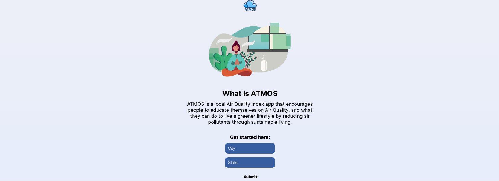
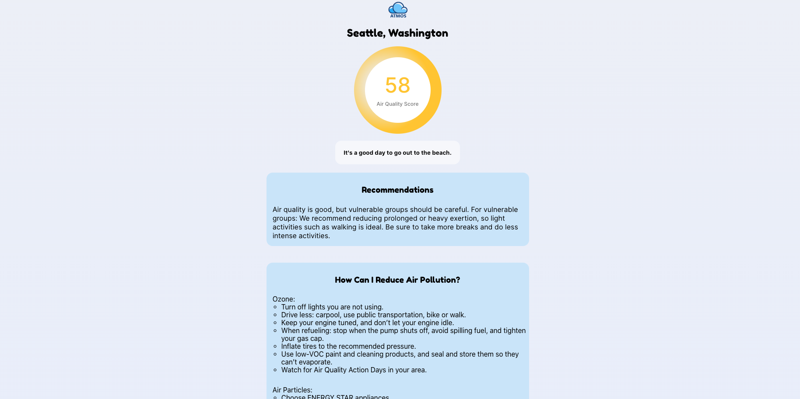
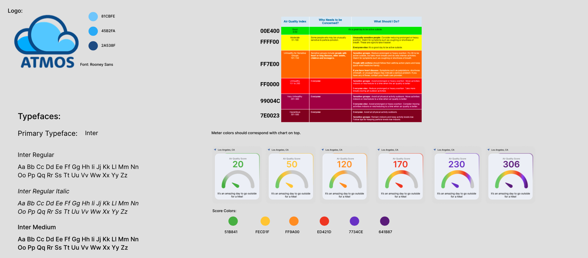
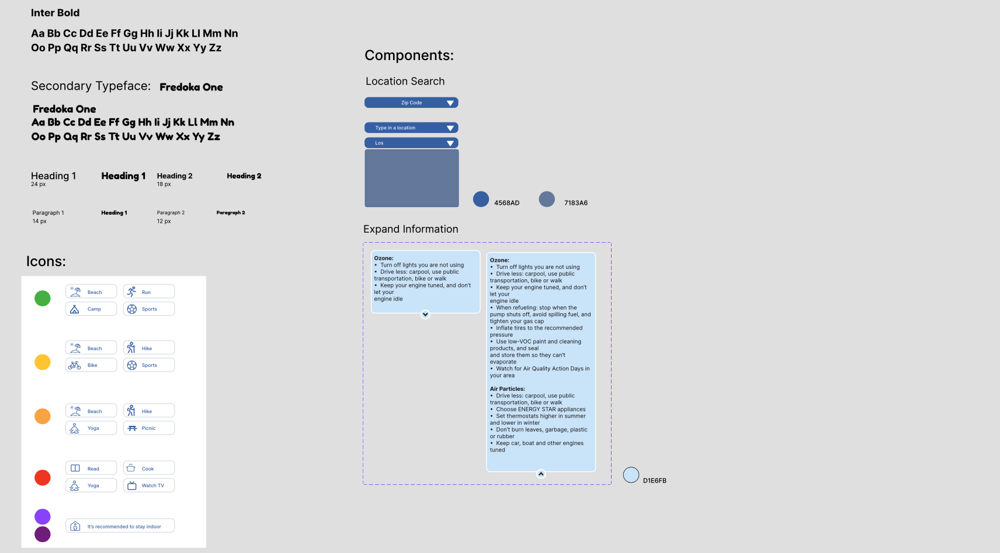
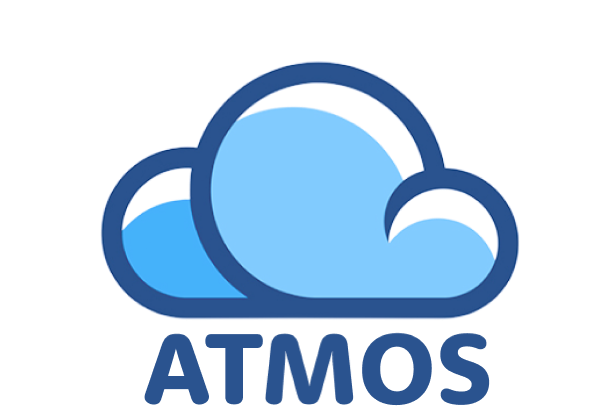
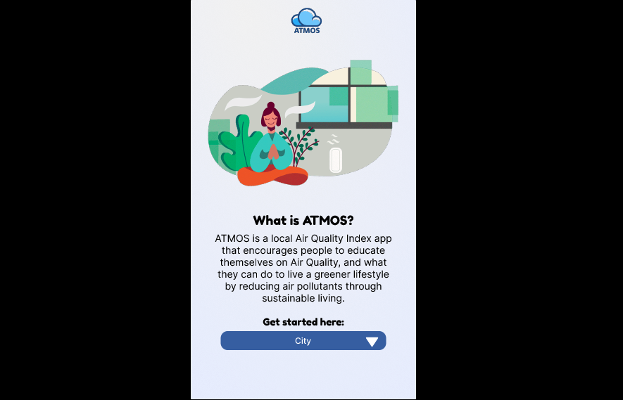
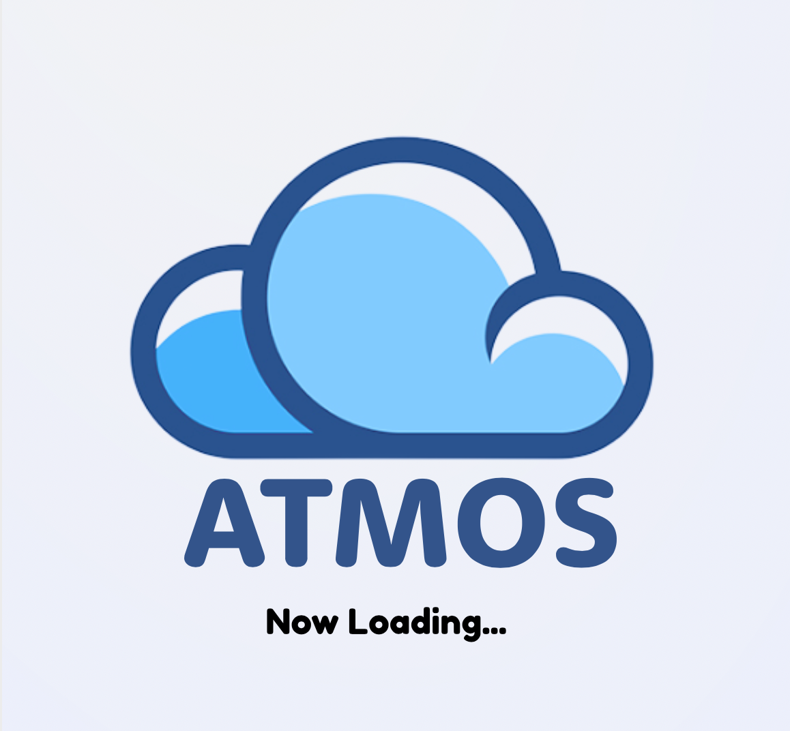
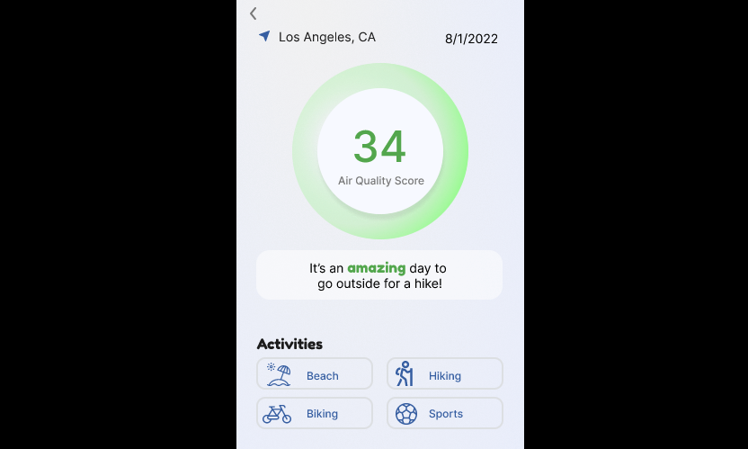
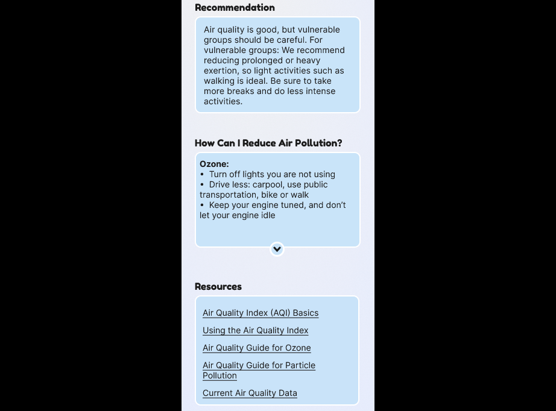

# Getting Started with Create React App

=== OVERVIEW ===

=== Overall Concept === 

'ATMOS' was created as part of General Assembly’s Summer 2022 West Coast Hackathon. The hackathon theme was to create an application that would promote environmental sustainability. 'ATMOS' delivers local air quality data to users after they input their city and state; it also gives recommendations based on current air quality and helps educate users on what they can do to keep their air quality in the green. This app was created in less than 3 days by an eight-person cross-functional team consisting of five software engineers and three UX/UI designers.

'ATMOS' is a full-stack Javascript MERN application with an independently hosted Express/Node/Mongoose API that serves as a cache and a React static front-end. It features integration with IQair’s AirVisual API to provide real-time air quality data, a memoized caching system to reduce API calls, recommendations based on current air quality, and a responsive, modern design.

=== Link to live site ===

You can check your local air quality with ATMOS [here](https://johndwatt.github.io/ATMOS/).

=== Engineering Team ===

Troy Mathis | https://www.linkedin.com/in/troy-mathis-dev/

Tyson Gomes | https://www.linkedin.com/in/tysonkgomes/

Dan Ventura | https://www.linkedin.com/in/dan-ventura221/

Brandon Kiefer | https://www.linkedin.com/in/brandonkiefer-se/

John D. Watt | https://www.linkedin.com/in/john-d-watt/ 

=== UX/UI Team ===

Francez Urmatan | https://www.linkedin.com/in/francez-urmatan

Sophie Li | https://www.linkedin.com/in/connectwithsophie/

Lux Siratana | https://www.linkedin.com/in/lux-siratana/

=== Main Technologies ===

- Javascript
- React
- Node
- Express
- Mongoose
- MongoDB 
- [AirVisual API](https://www.iqair.com/us/air-pollution-data-api)
- SASS

=== Pictures of Site ===

=== UX/UI DESIGN MATERIALS ===

=== User Research ===

=== WireFrames ===

This project was bootstrapped with [Create React App](https://github.com/facebook/create-react-app).
